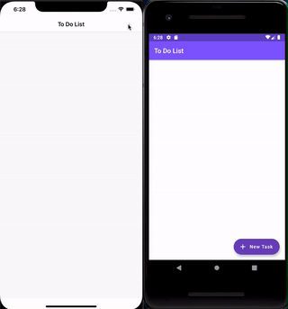

<h1 align="left">
    To Do List with Both Design (iOS/ANDROID) 
</h1>

<p align="left">

  
  <a href="https://www.codacy.com/manual/ewersoncastelo/To_Do_List_Flutter?utm_source=github.com&amp;utm_medium=referral&amp;utm_content=ewersoncastelo/To_Do_List_Flutter&amp;utm_campaign=Badge_Grade"></a>
<a href="https://github.com/ewersoncastelo/To_Do_List_Flutter/issues">
    
  </a>
    
  <a href="https://github.com/ewersoncastelo/To_Do_List_Flutter/commits/master">
    
  </a>
</p>

<p align="left">

  <a href="https://github.com/EwersonCastelo" target="_blank">
    
  </a>
  <a href="https://github.com/EwersonCastelo" target="_blank" >
    
  </a>
  <a href="https://www.linkedin.com/in/ewersoncastelo/" target="_blank" >
    
  </a>
  <a href="mailto:ewerson.castelo@gmail.com" target="_blank" >
    
  </a>
  <a href="https://api.whatsapp.com/send?phone=5569999682210"
        target="_blank" >
    
  </a>

</p>

## Description

A To Do List made by beginners with Objetive-C or Java makes a knot in the head, I know this because despite having already created some applications, some languages are quite complex, with a considerable learning curve ... but see what Flutter does: One code, two interfaces; I did a To Do List with Swift and the performance was very similar, so anyone who is in doubt keep calm.

## Preview



## Features

- Cupertino Design;
- Material Design;
- ListTile;
- Dismissible;
- Flutter Platform Widgets;
- Path Provider;
- SnackBar;
- Show Dialog;
- ListView;

## Instalation
-   [VS Code][vc] with this extensions installed [Flutter][flutterLink] and [Dart][dartLink]

## How To Use

To clone and run this application, you'll need [Git](https://git-scm.com), [Flutter][flutter] and [Android Studio][androidStudio] and/or [XCode][xCode] higher installed on your computer. From your command line:

```bash
# Clone this repository
$ git clone https://github.com/ewersoncastelo/To_Do_List_Flutter

# Go into the repository
$ cd To_Do_List_Flutter

# List devices available
$ flutter devices

# Run the app
$ flutter run -d [nameDevice]
```

## :memo: License
This project is under the MIT license. See the [LICENSE](https://github.com/ewersoncastelo/To_Do_List_Flutter/blob/master/LICENSE) for more information.

---

[flutter]: https://flutter.dev/docs/get-started/install
[androidStudio]: https://developer.android.com/studio/
[xCode]:https://apps.apple.com/br/app/xcode/id497799835?mt=12
[vc]: https://code.visualstudio.com/
[flutterLink]: https://flutter.dev/docs/development/tools/vs-code
[dartLink]:https://marketplace.visualstudio.com/items?itemName=Dart-Code.dart-code